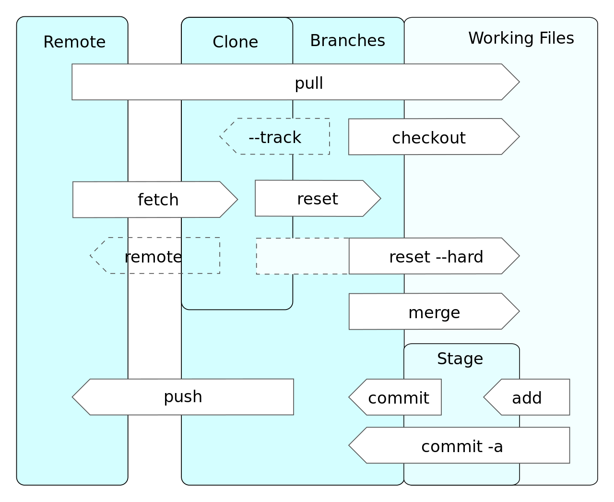

# Git 简要总结

## 主流程

1. 克隆仓库

```bash
# git clone [<options>] [--] <repo> [<dir>]

# 克隆仓库
git clone git@github.com:<USERNAME>/<repo>.git
# 克隆 dev 分支并切换到本地 dev 分支
git clone -b dev git@github.com:<USERNAME>/<repo>.git dev
```

2. 将文件变更记录写入到暂存区

```bash
# git add [<options>] [--] <pathspec>...

# 添加当前目录下所有文件
git add .
# 添加部分文件
git add src/main.js
```

3. 提交变更到本地版本库

```bash
# git commit [<options>] [--] <pathspec>...
# 默认是提交暂存区，不是工作区
git commit -m "feat: an ordinary commit"
# 保存到暂存区并提交
git commit -am "feat: an ordinary commit"
# 追加提交
git commit --amend
# 重置上次提交的 author 和 message
git commit --amend --reset-author
```

4. 推送代码到远程仓库

```bash
# git push [<options>] [<repository> [<refspec>...]]

# 提交本地当前分支到 origin 远程仓库的 master 分支
git push origin master
# 提交本地 dev 分支到 origin 远程仓库的 master 分支
git push origin master:dev
```

## 工作原理



- 工作区 `Working Files`
- 暂存区`Stage`
- 分支`Branches`
- 本地仓库`Local`
- 远程仓库`Remote`

工作流程

1. 在工作目录中修改文件。
2. 暂存文件，将文件的快照放入暂存区域。
3. 提交更新，找到暂存区域的文件，将快照永久性存储到本地仓库的分支中
4. 推送并合并到远程仓库的分支

## 常用命令

### git init

创建一个空白的 git 仓库

```bash
git init
```

### git add

```bash
# git add [<options>] [--] <pathspec>...

# 将工作区的文件修改、新增提交到暂存区，不包括删除
git add .
```

| 主要选项      | 说明                 |
| ------------- | -------------------- |
| 默认          | 文件修改、新增       |
| -u (--update) | 文件修改、删除       |
| -A (--all)    | 文件修改、删除、新增 |

### git commit

1. 提交

```bash
# git commit [<options>] [--] <pathspec>...

git commit -m 'message'
```

2. 追加提交，修改上一个 commit 的信息

```bash
git commit --amend -m 'new message'
```

### git remote

操作远程 git 仓库。

1. 查看远程仓库信息

```bash
git remote
```

2. 看远程仓库详细信息

```bash
git remote -v
```

3. 添加远程仓库

```bash
# git remote add [-t <branch>] [-m <master>] [-f] [--tags | --no-tags] [--mirror=<fetch|push>] <name> <url>
# 添加别名为 origin 的远程仓库，别名为必填
git remote add origin https://github.com/<USERNAME>/<REPO>.git
# or
git remote add origin git@github.com:<USERNAME>/<REPO>.git
```

4. 修改远程仓库

```bash
# git remote set-url origin <URL>
```

5. 重命名远程仓库

```bash
git remote rename oldname newname
```

6. 删除远程仓库

```bash
# git remote remove <name>

# 移除别名为 origin 的远程仓库
git remote remove origin
# or
git remote rm origin
```

### git branch

1. 列出本地存在的分支

```bash
git branch
```

2. 列出远程分支

```bash
git branch -r
```

3. 创建本地分支

```bash
# git branch [branchName] (remoteBranch)

# 基于远程仓库的 remote-branch 分支(可选), 创建本地仓库的 my-branch 分支
git branch my-branch remote-branch
```

4. 重命名分支

```bash
# git branch [<options>] (-m | -M) [<old-branch>] <new-branch>

# 将本地 my-branch 分支(可省略)重命名为 new-branch
git branch -M my-branch new-branch
```

5. 删除本地分支

```bash
# git branch -d | -D [branch-name]
# 强制删除 my-branch 分支（大写为强制删除）
git branch -D my-branch
```

7. 删除远程分支

```bash
# git branch [<options>] [-r] (-d | -D) <branch-name>.

# 删除 my-branch 分支
git push origin --delete my-branch
```

8. 关联跟踪上游分支

```bash
# git branch (--set-upstream | -u) <localBranch> <remote>/<remoteBranch>

# 本地 dev 分支将跟踪 origin 远程仓库的 dev 分支，
git branch --set-upstream-to=origin/dev dev
```

### git checkout

1. 切换分支:

```bash
# git checkout [<options>] <branch>

# 切换当前分支到 dev 分支
git checkout dev
# 基于当前分支创建 test 分支，并且将当前分支切换到 test 分支
git checkout -b test
```

2. 恢复初始状态

```bash
# git checkout [<tree-ish>] [--] <pathspec>…

# 将 index.js、others 恢复到当前 commit 的初始的状态
git checkout index.js others.js
```

### git merge

合并分支

```bash
# 合并远程仓库的 master 分支到当前分支
git merge origin/master
```

### git rebase

::: danger
Note: 绝对不要在公共分支上执行 `rebase` 操作
:::

重写操作记录

1. 操作分支

```bash
# 以 dev 分支重新为起点
git rebase dev

例子
git checkout feat

# 重置了 `feat` 分支的基线 (当前分支 `feat`、变基操作的目标基底分支 `master`)
git rebase master

# 如果出现冲突，解决后继续

# 切换到 `master`, 再合并 `feat` 分支
git checkout master
git merge feat
```

2. 修改记录

```bash
# -i 是弹出交互界面进行编辑，[startpoint] [endpoint]则指定了一个编辑区间
git rebase -i [startpoint] [endpoint]

# 编辑近三次提交
git rebase -i HEAD~3

# pick：保留该 commit（缩写:p）
# reword：保留该 commit，修改提交信息（缩写:r）
# edit：保留该 commit, 但我要停下来修改该提交（缩写:e）
# squash：将该 commit 和前一个 commit 合并（缩写:s）
# fixup：将该 commit 和前一个 commit 合并，但不会保留该提交的信息（缩写:f）
# exec：执行其他 bash 命令（缩写:x）
# drop：丢弃该 commit（缩写:d）
```

| 主要选项   | 说明                       |
| ---------- | -------------------------- |
| --continue | 确认已处理完毕，继续下一步 |
| --skip     | 跳过当前流程，继续下一步   |
| --abort    | 终止 `rebase` 操作并还原   |

### git cherry-pick

提取已有提交记录，合并到当前分支上。

```bash
# git cherry-pick [<options>] <commit-ish>...

# 将 xxxxxx 提交记录合并到当前分支下
git cherry-pick xxxxxx
# 将 xxxxxx 到 yyyyyy 的所有提交记录合并到当前分支下
git cherry-pick xxxxxx..yyyyyy
```

### git push

推送到远程仓库，同步本地仓库的提交历史到远程仓库

```bash
# git push [<options>] [<repository> [<refspec>...]]

# 提交本地仓库 master 分支到远程仓库的 master 分支
git push origin master
# 提交本地仓库 dev 分支到远程的 master 分支
git push origin dev:master
# 强制推送，会覆盖提交记录
git push -f origin
```

### git pull

拉取远程仓库某个分支，并和本地分支进行合并

```bash
# git pull <远程仓库别名> <远程分支名>:<本地分支名>，若存在追踪关系，可省略远程分支名
# git pull [<options>] [<repository> [<refspec>...]]

# 默认的 pull 行为等同于 git fetch && git merge
# 即 git fetch origin master && git merge origin/master
git pull origin master

# (推荐) 通过变基的方式来拉取代码, 保持线性的提交记录
# 等同于 git fetch origin master && git rebase origin/master
git pull --rebase origin master
```

### git reset

回退

```bash
# git reset [--hard|soft|mixed|merge|keep] [<commit>

# 回退到 xxxxxx，丢弃之后的提交内容
git reset --hard xxxxxx

# 或者使用 revert 反向创建新记录，重做之后的提交内容
```

| 主要选项 | 说明                                               |
| -------- | -------------------------------------------------- |
| --soft   | 暂存区和工作区都不会被改变                         |
| --mixed  | 默认选项, 暂存区会同步到指定的提交，工作区不受影响 |
| --hard   | 暂存区和工作区都同步到指定的提交                   |

### git tag

1. 创建标签

```bash
git tag -a v1.1.0 -m '备注'
```

2. 列出已有的标签

```bash
git tag
```

3. 将标签推送到 origin 远程仓库

```bash
# 推送单个标签
git push origin v1.0.0
# 推送所有标签
git push origin --tags
```

4. 删除本地标签

```bash
git tag -d v1.0.0
```

5. 删除 origin 远程仓库的标签

```bash
# Git version > v1.7.0
git push origin --delete v1.0.0

# 通用
git tag -d v1.0.0
git push origin :refs/tags/v1.0.0
```

### git stash

将当前工作区和暂存区更改的内容暂存，需要时再将重新弹出。

```bash
# 临时存放，临时存放区是一个栈的结构，支持多次临时存放
git stash

# 查看所有存储内容
git stash list

# 重新弹出到工作区
git stash pop

# 删除储存内容
git stash drop stash@{1}   # 删除指定储存
git stash clear            # 删除所有
```

## 仓库元数据

每一个代码仓库目录下，都会有一个 `.git` 的文件夹，其中主要文件如下：

| 文件(夹)    | 含义                                                                                  |
| :---------- | :------------------------------------------------------------------------------------ |
| config      | 配置文件                                                                              |
| description | 描述，仅供 Git Web 程序使用                                                           |
| HEAD        | 当前被检出的分支                                                                      |
| index       | 暂存区信息                                                                            |
| hooks/      | 客户端或服务端的钩子脚本（hook scripts）                                              |
| info/       | 全局排除 global exclude 文件, 不被记录在 .gitignore 文件中的忽略模式 ignored patterns |
| refs/       | 数据（分支）的提交对象的指针                                                          |

## 技巧

### 添加指定文件

```bash
git ls-files src/ | grep '\.css$' | xargs git add
```

### 修改 commit 时间

```bash
# 使用 rebase 修改历史提交
git rebase -i HEAD~4

# 将 pick 改为 edit

# 设置提交时间的临时环境变量 (可选)
# 以 PowerShell 为例
$env:GIT_COMMITTER_DATE="2017-10-08T09:51:07"

# 修改 commit 的时间 (author date)
git commit --amend --date="2017-10-08T09:51:07"

# 确定并进入下一个需要修改的提交
git rebase --continue
```

### 删除所有提交中的指定文件

```bash
# 删除文件
git filter-branch --force --index-filter 'git rm --cached --ignore-unmatch -r build' --prune-empty --tag-name-filter cat -- --all

# 触发 GC
git reflog expire --expire=now --all && git gc --prune=now --aggressive
```

## 其他

### [LearnGitBranching](https://learngitbranching.js.org/)

### [Git 的奇技淫巧](https://github.com/521xueweihan/git-tips)
